<div align="center">

# DocuAuto

**Plataforma de gestión de mantenimiento, gastos y documentación vehicular para particulares, familias y flotas.**

[English](README.md) · **Español**

[](https://docuauto.com)


</div>

> DocuAuto es un SaaS en producción usado en Argentina para mantener el historial completo de un vehículo en un solo lugar: mantenimientos, gastos, documentación legal (VTV, seguro, oblea de GNC) y alertas de vencimiento. Los dueños pueden compartir un **reporte público verificado** de su vehículo al momento de venderlo.
>
> El código fuente es privado. Este documento describe el producto, la arquitectura, las decisiones de ingeniería y las prácticas de calidad que hay detrás.

<div align="center">
  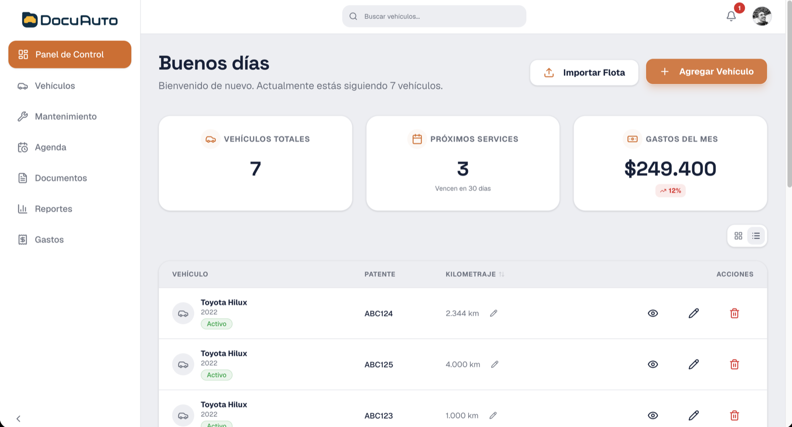
  <p><em>Dashboard de flota. Todas las capturas usan datos de demostración.</em></p>
</div>

---

## Índice

- [Resumen del Producto](#resumen-del-producto)
- [Funcionalidades Clave](#funcionalidades-clave)
- [Recorrido por el Producto](#recorrido-por-el-producto)
- [Stack Tecnológico](#stack-tecnológico)
- [Arquitectura](#arquitectura)
- [Modelo de Datos](#modelo-de-datos)
- [Seguridad](#seguridad)
- [Aspectos Destacados del Dominio](#aspectos-destacados-del-dominio)
- [Testing y Calidad](#testing-y-calidad)
- [Rendimiento y Operación](#rendimiento-y-operación)
- [Flujo de Entrega](#flujo-de-entrega)
- [Puesta en Marcha](#puesta-en-marcha)
- [Scripts](#scripts)
- [Convenciones de Ingeniería](#convenciones-de-ingeniería)
- [Roadmap](#roadmap)
- [Autor](#autor)
- [Licencia](#licencia)

---

## Resumen del Producto

### El problema

En Argentina, mantener un vehículo al día implica seguir muchos vencimientos sin relación entre sí: la verificación técnica periódica (VTV/ITV), la renovación del seguro, la oblea de GNC y la prueba hidráulica, además de los services por kilometraje como el cambio de aceite o la correa de distribución. Esa información suele vivir en carpetas de papel, comprobantes sueltos y en la memoria, y se pierde cuando el vehículo se vende.

### La solución

DocuAuto centraliza el ciclo de vida completo de cada vehículo y lo convierte en información accionable:

- **Los dueños** ven qué les vence próximamente, por fecha o por kilómetros, y reciben avisos antes del vencimiento.
- **Familias y flotas chicas** administran varios vehículos desde un solo dashboard con reportes de costos.
- **Los compradores** pueden consultar un reporte de mantenimiento público y verificado antes de comprar un usado.
- **Los talleres** (en desarrollo) van a poder registrar services directamente en el historial del vehículo de sus clientes.

### Planes

| Plan | Vehículos | Incluye |
|---|---|---|
| Free | 1 | Historial de mantenimiento, gastos, documentos, reporte público del vehículo |
| Familiar | 3 | + Alertas de vencimiento por email, exportación a PDF/Excel |
| Empresas | 15 | + Importación masiva por CSV |
| Pro | Ilimitados | + Soporte prioritario |

Las suscripciones son pagos recurrentes procesados con **MercadoPago**.

---

## Funcionalidades Clave

**Gestión de vehículos**
- Perfiles de vehículo (motorización: nafta, GNC, diésel, híbrido, eléctrico; uso pesado; taxi/uso intensivo) que adaptan las reglas de mantenimiento automáticamente
- Estados del ciclo de vida (`active`, `sold`, `retired`, `archived`); solo los vehículos activos cuentan para el límite del plan
- Odómetro protegido contra retrocesos a nivel base de datos, con kilometraje inicial inmutable
- Importación masiva desde CSV y exportación a PDF, Excel y CSV

**Inteligencia de mantenimiento**
- Motor de reglas con intervalos por service según kilómetros, tiempo, o ambos (lo que ocurra primero)
- Intervalos personalizables por vehículo
- Proyecciones del próximo service calculadas solo sobre historial real (sin datos inventados)
- Vista de agenda con lo próximo y lo vencido en todos los vehículos

**Documentos y alertas**
- Bóveda segura de documentos por vehículo (PDF/JPG/PNG) con fechas de vencimiento
- Cron diario que envía alertas consolidadas por email a 30 días, 15 días y el día del vencimiento, con logs de deduplicación
- Centro de notificaciones en la app con alertas descartables

**Reportes**
- KPIs, gasto en el tiempo, costo por kilómetro, desglose por categoría y vehículos que requieren atención
- Períodos configurables (30/90 días, 6/12 meses, histórico) con comparación contra el período anterior
- Reporte público verificado por vehículo, compartible por link

**Plataforma**
- Autenticación con email/contraseña y Google OAuth, confirmación por email y recuperación de contraseña
- Facturación de suscripciones con activación y cancelación del plan disparadas por webhook
- Panel de administración: métricas de la plataforma, tamaño de la base, salud del servidor, blog y verificación de talleres
- Motor de blog propio (editor Markdown, programación de publicaciones, campos SEO, sitemap dinámico)
- Emails transaccionales construidos con React Email (11 templates)
- Modo oscuro e interfaz totalmente responsive

---

## Recorrido por el Producto

Cada pantalla a continuación es la aplicación real corriendo con datos de demostración.

### Centro de mantenimiento

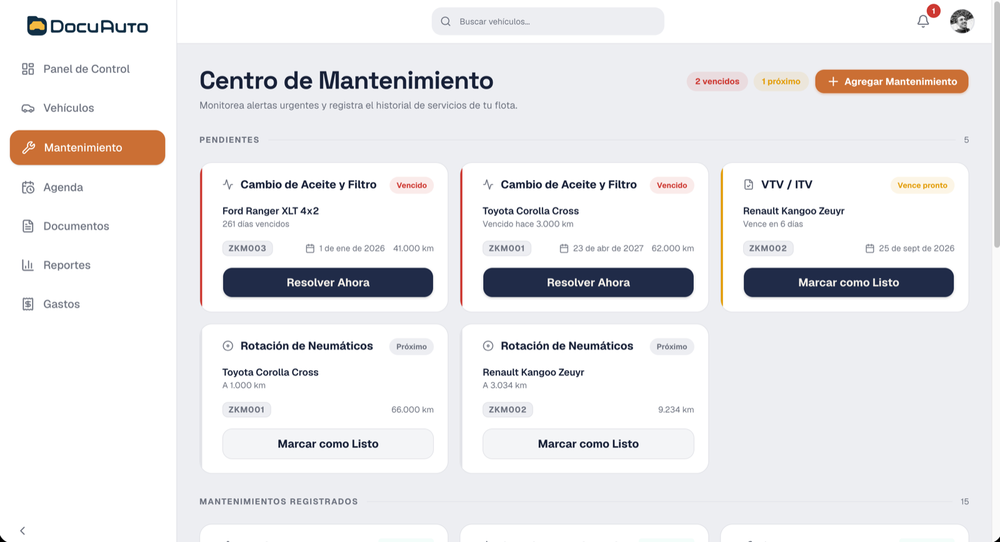

El trabajo pendiente de toda la flota, ordenado por urgencia. Cada tarjeta indica por qué el ítem está vencido: días de atraso en las reglas por tiempo, kilómetros de exceso en las reglas por kilometraje.

### Proyección de services

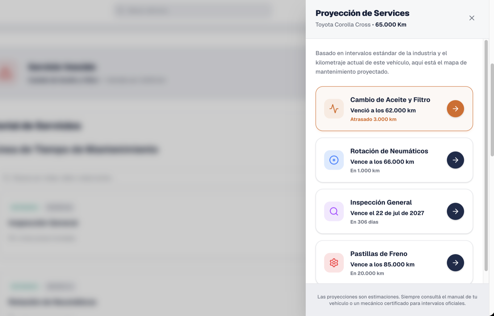

El motor de mantenimiento calcula las dos restricciones de cada regla (kilómetros y tiempo) a partir del último registro real e informa la que ocurre primero. No se muestra nada para un service que no tiene historial previo.

### Agenda

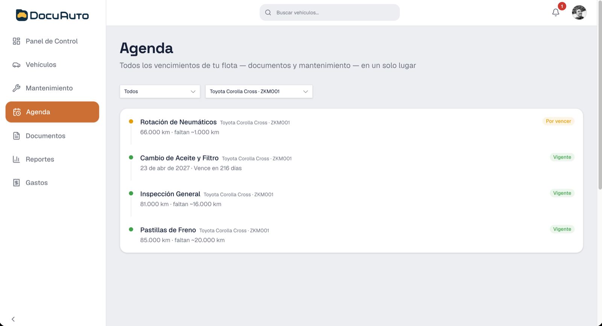

Documentos y mantenimientos unificados en una sola lista ordenada de vencimientos, filtrable por vehículo y por tipo.

### Detalle del vehículo

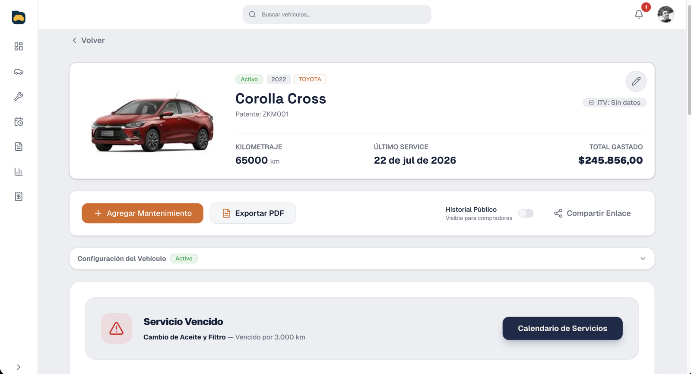

Resumen por vehículo, exportación a PDF y el switch que publica el reporte de mantenimiento compartible.

### Reportes

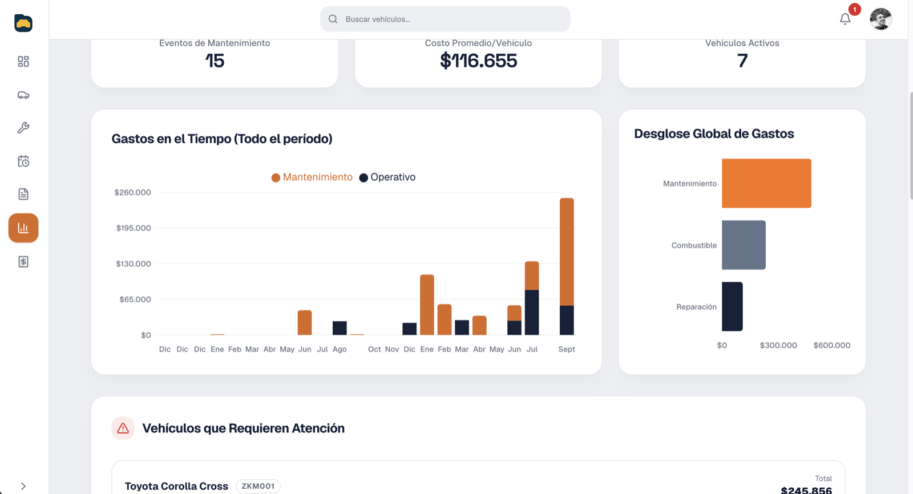

Gasto en el tiempo separado entre mantenimiento y costos operativos, desglose por categoría, costo por kilómetro y los vehículos que concentran el gasto de la flota, todo sobre un período configurable.

### Reporte público del vehículo

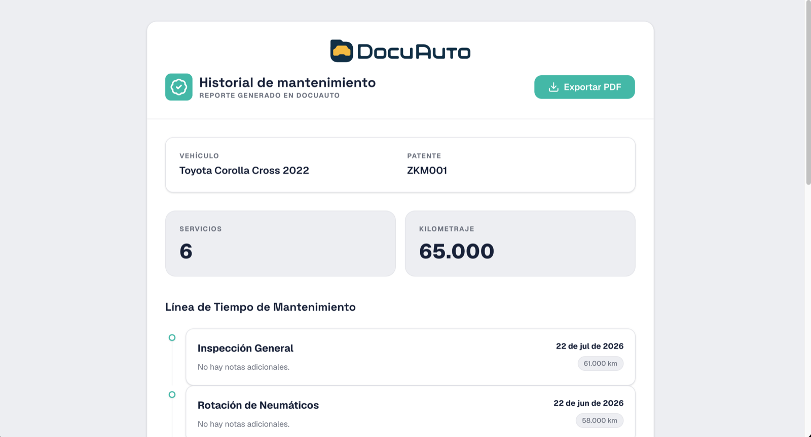

El reporte que el dueño comparte con un comprador: línea de tiempo de services y kilometraje, servido desde una ruta pública sin acceso al resto de la cuenta.

<details>
<summary><strong>Más pantallas</strong></summary>

#### Alta de un service

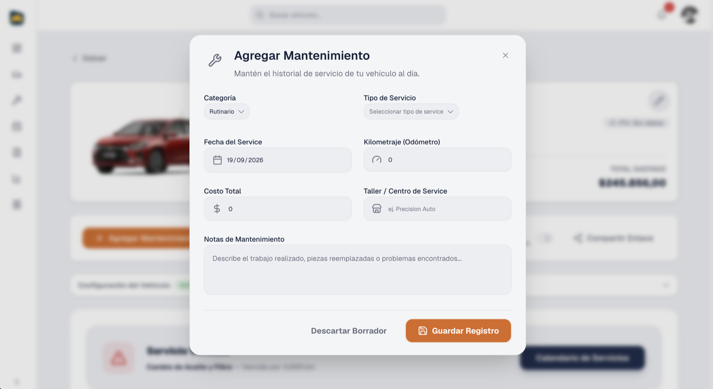

#### Historial de services

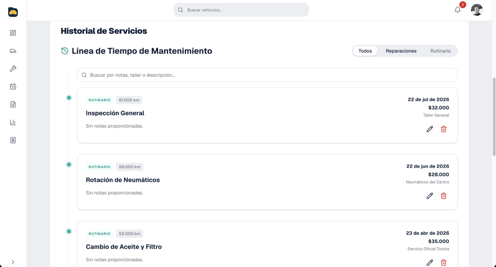

#### Bóveda de documentos

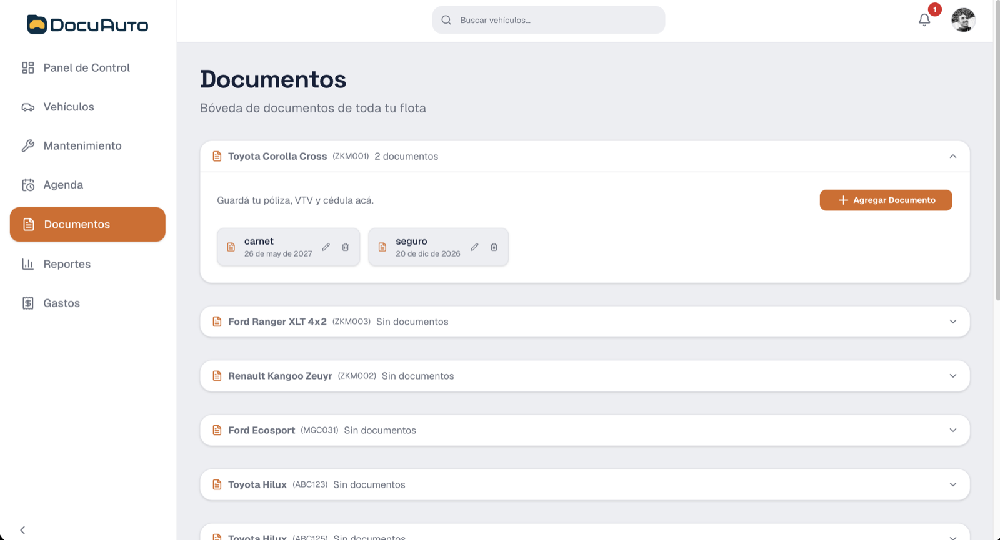

#### Gastos

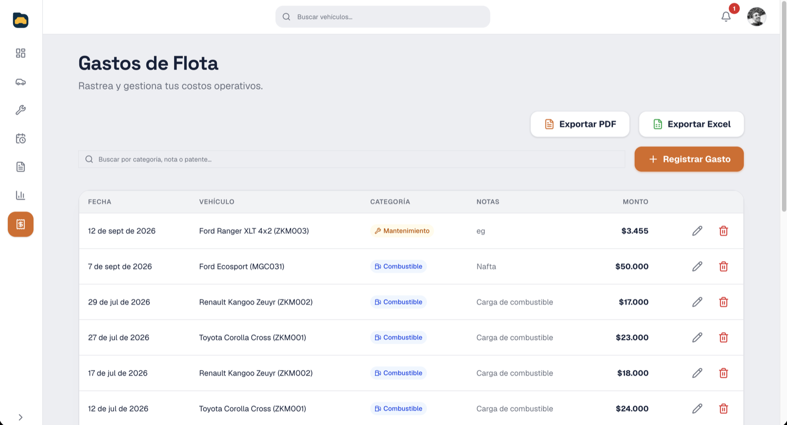

#### KPIs de reportes

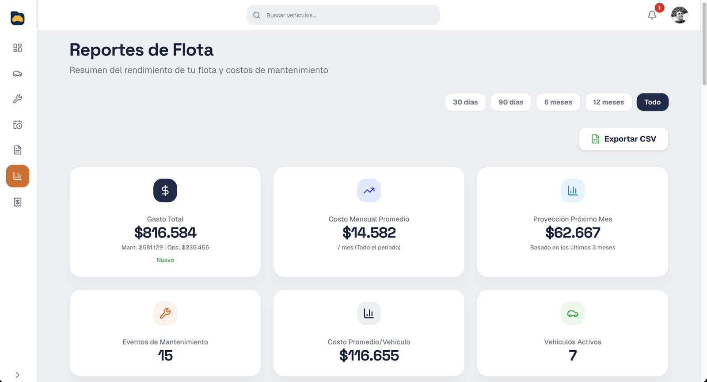

#### Top de vehículos por gasto de mantenimiento

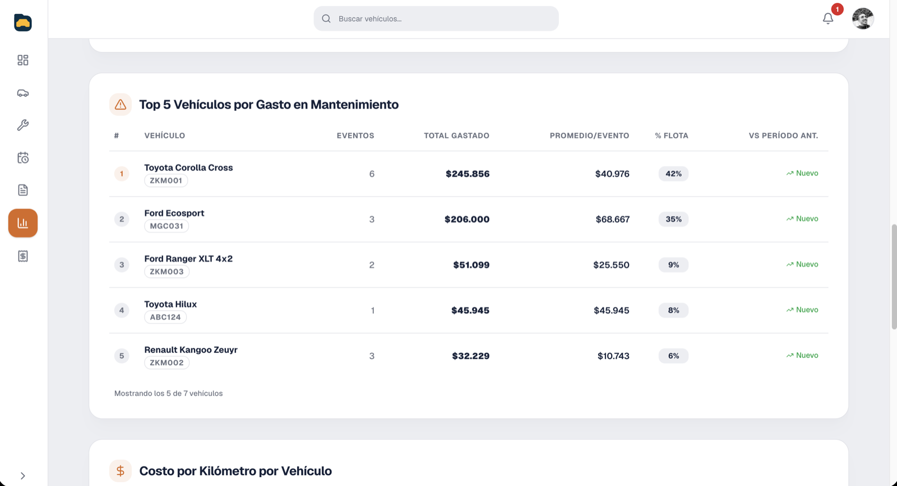

#### Costo por kilómetro

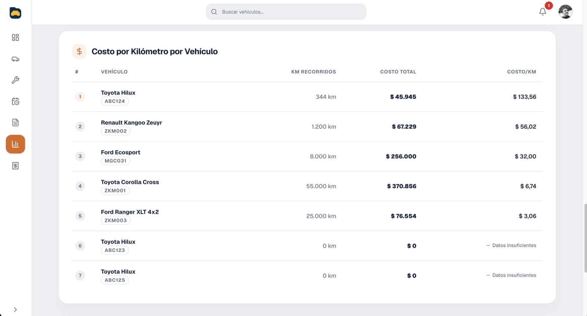

#### Configuración de la cuenta

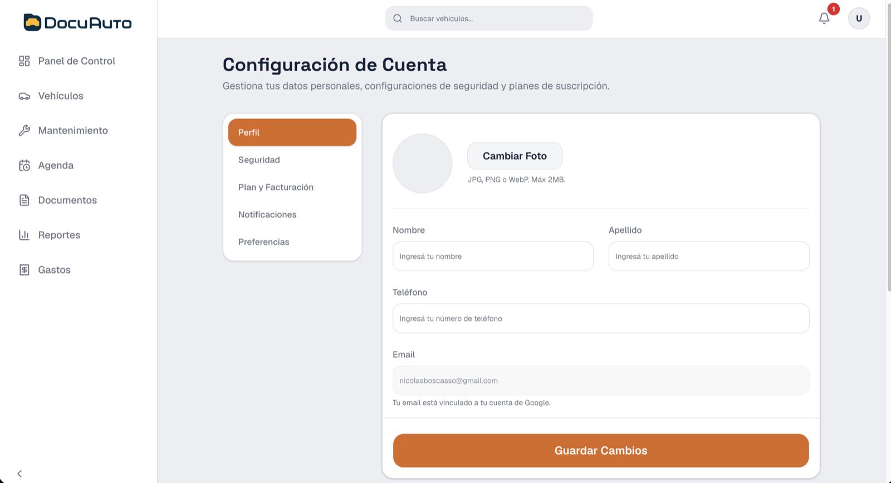

#### Sitio de marketing

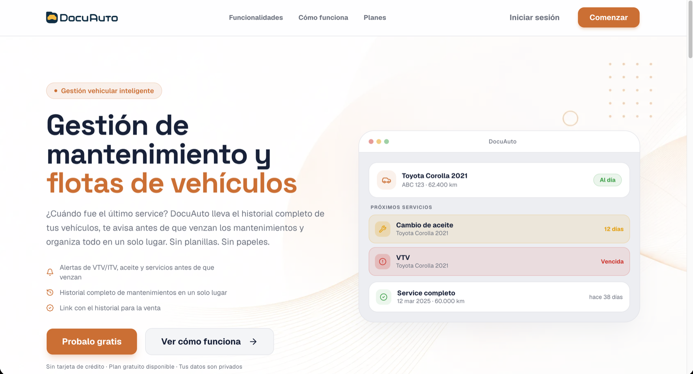

#### Blog

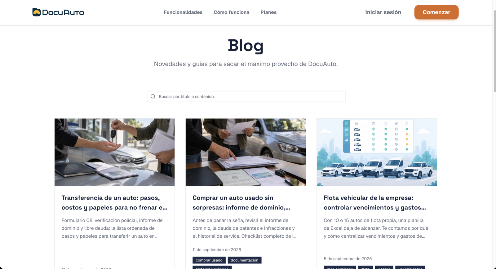

</details>

---

## Stack Tecnológico

| Capa | Tecnologías |
|---|---|
| **Frontend** | Next.js 16 (App Router, Server Components, Server Actions), React 19, React Compiler, TypeScript (strict) |
| **UI** | Tailwind CSS v4, shadcn/ui, Radix UI, Framer Motion, Recharts, Sonner, íconos Lucide / Phosphor, next-themes |
| **Formularios y estado** | React Hook Form, Zod 4 (schemas compartidos cliente/servidor), nuqs (estado en la URL para tablas, filtros y paginación) |
| **Backend** | Server Actions y Route Handlers de Next.js sobre un proceso Node.js 22 persistente |
| **Base de datos** | Supabase: PostgreSQL 17, Row Level Security, triggers y funciones de base de datos, Storage, Auth |
| **Pagos** | Suscripciones de MercadoPago (preapproval) detrás de una abstracción de pasarela de pago, con una pasarela mock |
| **Email** | Resend + React Email |
| **Seguridad** | Cloudflare Turnstile, RLS, webhooks verificados por HMAC, rate limiting, logger que enmascara PII |
| **Documentos** | jsPDF + AutoTable, SheetJS (xlsx), PapaParse, react-markdown |
| **Testing** | Vitest 4 + cobertura V8, pgTAP (base de datos/RLS), Playwright (E2E), k6 (carga) |
| **Tooling** | ESLint 9, Supabase CLI, Docker, deploys basados en Git |
| **Hosting** | Hostinger (Node.js), Supabase Cloud |

---

## Arquitectura

### Contexto del sistema

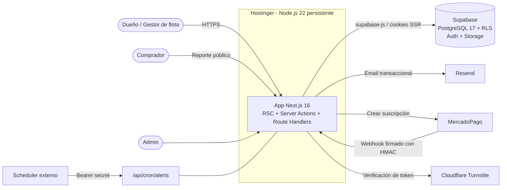
```mermaid
flowchart LR
    User([Dueño / Gestor de flota]) -->|HTTPS| App
    Buyer([Comprador]) -->|Reporte público| App
    Admin([Admin]) --> App

    subgraph Hosting["Hostinger - Node.js 22 persistente"]
        App["App Next.js 16<br/>RSC + Server Actions + Route Handlers"]
    end

    App -->|supabase-js / cookies SSR| SB[(Supabase<br/>PostgreSQL 17 + RLS<br/>Auth + Storage)]
    App -->|Email transaccional| Resend[Resend]
    App -->|Crear suscripción| MP[MercadoPago]
    MP -->|Webhook firmado con HMAC| App
    Scheduler[Scheduler externo] -->|Bearer secret| Cron["/api/cron/alerts"]
    Cron --- App
    App -->|Verificación de token| TS[Cloudflare Turnstile]
```

### Ciclo de vida de un request

Cada funcionalidad sigue el mismo flujo, que mantiene el fetching de datos en el servidor y las reglas de negocio fuera de la UI:

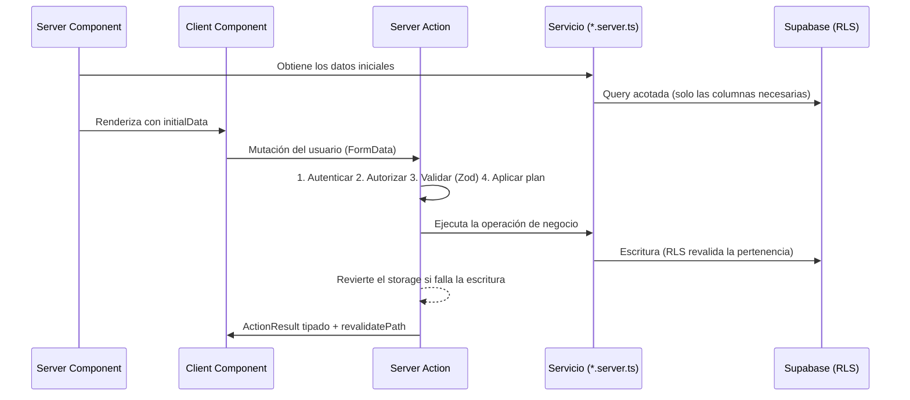
```mermaid
sequenceDiagram
    participant RSC as Server Component
    participant CC as Client Component
    participant SA as Server Action
    participant SVC as Servicio (*.server.ts)
    participant DB as Supabase (RLS)

    RSC->>SVC: Obtiene los datos iniciales
    SVC->>DB: Query acotada (solo las columnas necesarias)
    RSC->>CC: Renderiza con initialData
    CC->>SA: Mutación del usuario (FormData)
    SA->>SA: 1. Autenticar  2. Autorizar  3. Validar (Zod)  4. Aplicar plan
    SA->>SVC: Ejecuta la operación de negocio
    SVC->>DB: Escritura (RLS revalida la pertenencia)
    SA-->>SA: Revierte el storage si falla la escritura
    SA->>CC: ActionResult tipado + revalidatePath
```

### Capas y reglas de dependencia

```
lib/  →  services/  →  actions/  →  features/  →  app/
(baja)                                             (alta)
```

| Capa | Responsabilidad | Regla |
|---|---|---|
| `lib/domain/` | Reglas puras de dominio (motor de mantenimiento, estado del vehículo) | Sin I/O, sin código de framework |
| `lib/` | Utilidades compartidas: chequeo de planes, gating, fechas, logger, schemas | Nunca importa de `features/` ni `app/` |
| `services/*.server.ts` | Acceso a datos contra Supabase | Sin orquestación |
| `actions/` | Server Actions: solo orquestación | auth → authz → validación → plan → servicio → revalidate |
| `features/<name>/` | Componentes, hooks, schemas y servicios de la feature | Las features no se importan entre sí |
| `app/` | Rutas (App Router) | Delgadas: obtienen datos por un servicio de feature y pasan props |

Tres clientes de Supabase materializan el límite de confianza: un cliente **servidor** atado a la sesión del usuario, un cliente **browser**, y un cliente **service-role** restringido a operaciones públicas que deben saltear RLS (nunca usado en nombre de un usuario autenticado).

### Estructura del repositorio

```
docuauto/
├── apps/web/                     # Aplicación Next.js
│   ├── src/
│   │   ├── app/                  # Rutas: marketing, dashboard, billing, admin, taller, api
│   │   ├── actions/              # Server Actions
│   │   ├── services/             # Acceso a datos e integraciones (billing, email, PDF)
│   │   ├── features/             # admin, agenda, blog, contact, dashboard, documents,
│   │   │                         # expenses, maintenance, reports, settings, vehicles, workshop
│   │   ├── lib/                  # Reglas de dominio, planes, fechas, logger, schemas
│   │   ├── components/           # Primitivos shadcn/ui, componentes compartidos, templates de email
│   │   ├── types/                # Tipos generados de la base + tipos de dominio
│   │   └── proxy.ts              # Refresco de sesión y protección de rutas
│   ├── e2e/                      # Tests end-to-end con Playwright
│   └── scripts/verify.sh         # Quality gate local
├── supabase/
│   ├── migrations/               # Schema baseline + migraciones incrementales
│   └── tests/database/           # Tests de seguridad con pgTAP
└── performance/k6/               # Tests de carga
```

---

## Modelo de Datos

14 tablas, todas protegidas por Row Level Security (28 políticas de tabla), más 13 políticas de storage sobre 6 buckets.

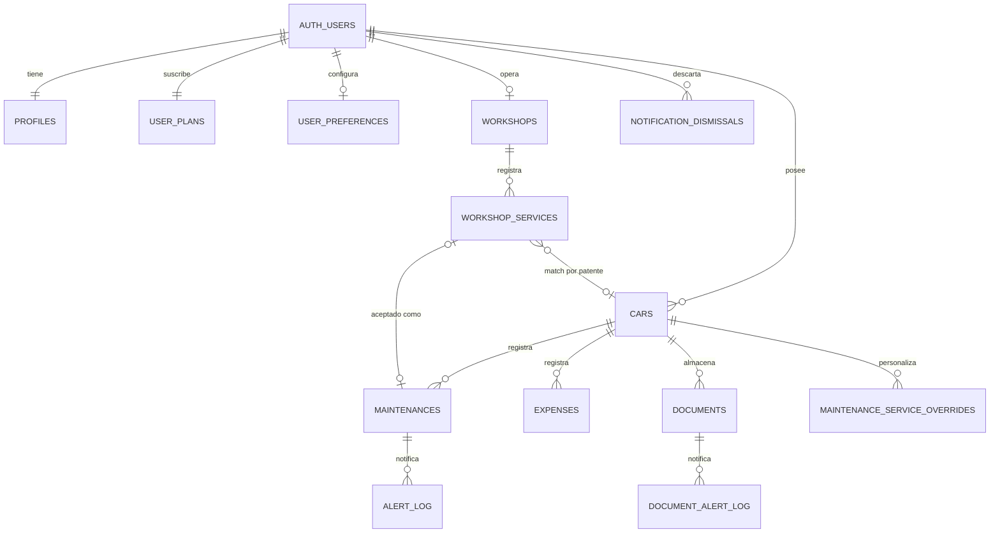
```mermaid
erDiagram
    AUTH_USERS ||--|| PROFILES : tiene
    AUTH_USERS ||--|| USER_PLANS : suscribe
    AUTH_USERS ||--o| USER_PREFERENCES : configura
    AUTH_USERS ||--o{ CARS : posee
    CARS ||--o{ MAINTENANCES : registra
    CARS ||--o{ EXPENSES : registra
    CARS ||--o{ DOCUMENTS : almacena
    CARS ||--o{ MAINTENANCE_SERVICE_OVERRIDES : personaliza
    AUTH_USERS ||--o| WORKSHOPS : opera
    WORKSHOPS ||--o{ WORKSHOP_SERVICES : registra
    WORKSHOP_SERVICES }o--o| CARS : "match por patente"
    WORKSHOP_SERVICES |o--o| MAINTENANCES : "aceptado como"
    MAINTENANCES ||--o{ ALERT_LOG : notifica
    DOCUMENTS ||--o{ DOCUMENT_ALERT_LOG : notifica
    AUTH_USERS ||--o{ NOTIFICATION_DISMISSALS : descarta
```

Los invariantes de negocio se garantizan **en la base de datos**, no solo en el código de la aplicación:

| Función / trigger | Garantiza |
|---|---|
| `check_vehicle_plan_limit` | Un usuario nunca puede superar el límite de vehículos de su plan, ni con requests concurrentes ni con importaciones masivas |
| `fn_ratchet_current_km` / `fn_cars_validate_current_km` | El odómetro solo avanza |
| `normalize_plate` | Las patentes se guardan en un formato canónico |
| `has_write_access` / `is_subscription_active` | Modo solo lectura para suscripciones vencidas |
| `handle_new_user_plan` / `sync_profile_from_auth_user` | Toda cuenta nueva obtiene plan y perfil de forma atómica |
| `prevent_workshop_verified_self_update` | Los talleres no pueden autoverificarse |

---

## Seguridad

La seguridad está en capas, de modo que una falla en una capa la atrapa la siguiente.

| Capa | Controles |
|---|---|
| **Edge / proxy** | Refresco de sesión en cada request, rutas protegidas que redirigen al login con URLs de retorno a prueba de open redirect, rutas de admin filtradas en el proxy |
| **Formularios** | Cloudflare Turnstile en login, registro y contacto; rate limiting por IP en autenticación; bloqueo de cuenta luego de 3 intentos fallidos |
| **Server Actions** | Autenticación, verificación de pertenencia, validación con Zod y aplicación del plan en cada escritura, sin importar el estado de la UI |
| **Base de datos** | Row Level Security en todas las tablas, pertenencia verificada sobre la fila padre en cada escritura hija, carpetas de storage por usuario, buckets privados para documentos |
| **Integraciones** | Verificación de firma HMAC en los webhooks de pago, secreto compartido en los webhooks de base de datos, bearer secret en los endpoints de cron |
| **Manejo de datos** | Atomicidad entre storage y base con rollback de archivos huérfanos, respuestas de error genéricas que no revelan la existencia de recursos, logger que enmascara emails, patentes e IDs numéricos |
| **Contenido** | Markdown renderizado sin HTML crudo (a prueba de XSS por diseño) |
| **HTTP** | HSTS (preload), `X-Frame-Options: DENY`, `X-Content-Type-Options`, Referrer-Policy y Permissions-Policy estrictas |

---

## Aspectos Destacados del Dominio

Algunos problemas de ingeniería que moldearon el código:

**Límites de plan en tres capas.** Los límites se reflejan en la UI (acciones deshabilitadas con el motivo), se validan en cada Server Action y se garantizan con un trigger de PostgreSQL. La UI es una comodidad; la base de datos es la fuente de verdad.

**Motor de mantenimiento con doble restricción.** Cada regla de service puede definir un intervalo por kilómetros, por tiempo, o ambos. El motor calcula las dos restricciones desde el último registro real, las normaliza a una escala común (promedio de km/día) e informa la que ocurre primero. Las reglas se adaptan al perfil del vehículo: un auto eléctrico no tiene cambios de aceite, uno a GNC suma vencimientos de oblea, un taxi recibe intervalos más cortos.

**Fechas a prueba de zonas horarias.** Los valores `date` de PostgreSQL viajan como strings `YYYY-MM-DD` y nunca se parsean como UTC. La aritmética de meses se recorta al fin de mes (31 de enero + 1 mes = 28 de febrero). El proceso del servidor está fijado a `America/Argentina/Buenos_Aires`, así "hoy" es el mismo para los cron jobs, los reportes y la UI sin importar la zona horaria del host. Esto está cubierto por un test dedicado.

**Abstracción de la pasarela de pago.** La facturación depende de una interfaz `PaymentGateway` con una implementación de MercadoPago y una mock. La activación del plan ocurre únicamente mediante webhooks verificados, nunca desde el redirect del cliente, así un usuario no puede activarse un plan visitando la URL de éxito.

**Alertas idempotentes.** El job diario de alertas agrupa los vencimientos de cada usuario en un solo email y escribe logs de envío, de modo que los reintentos o las corridas superpuestas nunca duplican notificaciones.

---

## Testing y Calidad

### Portafolio de tests

| Nivel | Herramienta | Alcance | Tamaño |
|---|---|---|---|
| **Unitarios e integración** | Vitest 4 | Reglas de dominio, Server Actions, servicios, rutas de API, webhooks, proxy, billing | 993 tests / 58 archivos |
| **Seguridad de base de datos** | pgTAP sobre Supabase local | RLS real: lectura/escritura/borrado entre usuarios, acceso anónimo, buckets de storage, trigger de límite de plan | 60 tests / 5 suites |
| **End-to-end** | Playwright (Chromium) | Registro y login, rutas protegidas, alta de vehículo + subida de documento, límite de plan, checkout | 4 flujos críticos |
| **Carga** | k6 | Páginas públicas y reporte público del vehículo con usuarios concurrentes | Umbrales de p95 < 500 ms |

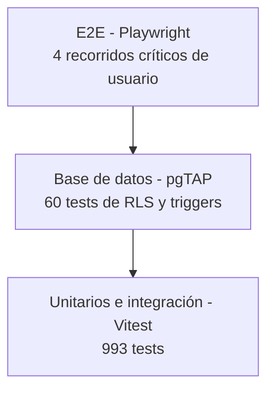
```mermaid
flowchart TB
    E2E["E2E - Playwright<br/>4 recorridos críticos de usuario"]
    DB["Base de datos - pgTAP<br/>60 tests de RLS y triggers"]
    UNIT["Unitarios e integración - Vitest<br/>993 tests"]
    E2E --> DB --> UNIT
```

### Cobertura

Medida con V8 sobre la suite de Vitest. Los umbrales se aplican por capa y solo suben.

| Capa | Cobertura de líneas | Piso exigido |
|---|---|---|
| `src/lib` (reglas de dominio, planes, fechas) | **87%** | 85% |
| `src/actions` (Server Actions) | **79%** | 77% |
| `src/app/api` (webhooks, cron) | **78%** | 75% |
| `src/proxy.ts` (protección de rutas) | **≥ 94%** | 94% |
| `src/services` (acceso a datos) | 41% | 39% |
| Todo el código (incluye componentes de UI) | 37% | n/a |

La cobertura apunta al código crítico de negocio antes que a un número global: los caminos de acceso a datos se validan además contra una base real con pgTAP y de punta a punta con Playwright.

### Quality gate

Cada push va precedido de un único comando que debe pasar:

```bash
npm run verify   # ESLint → TypeScript (tsc --noEmit) → Vitest con umbrales de cobertura → build de producción
```

### Prácticas de testing

- Tiempo determinista con fake timers, y tests de fechas verificados bajo varias zonas horarias del host
- Chequeos de mutación sobre aserciones críticas (por ejemplo, subir el límite del plan debe hacer fallar el test E2E de límite)
- Los E2E corren solo contra un stack local de Supabase y se niegan a arrancar si apuntan a una URL no local; todos los secretos de terceros se sobrescriben
- Datos de prueba aislados por un dominio de email dedicado y limpiados antes de cada corrida

---

## Rendimiento y Operación

- **Renderizado:** Server Components en las páginas con mucha data, generación estática para las páginas de marketing, ISR para el blog y el sitemap
- **Queries:** selects acotados por columna, paginación, queries independientes en paralelo, fetches agrupados, queries de agregación para métricas
- **Runtime:** un único proceso Node.js persistente, lo que permite rate limiting en memoria y cachés de corta vida sin almacenes externos
- **Observabilidad:** endpoint `/api/health` con latencia de base de datos, panel de salud del servidor en el admin, logging estructurado con enmascarado de PII
- **Tests de carga:** scripts de k6 con umbrales de latencia p95 para el tráfico público

---

## Flujo de Entrega

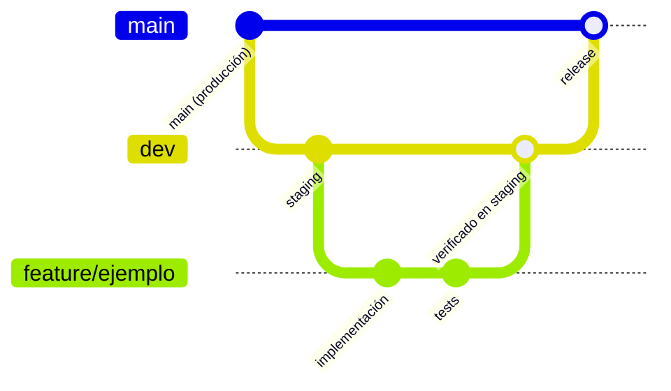
```mermaid
gitGraph
    commit id: "main (producción)"
    branch dev
    commit id: "staging"
    branch feature/ejemplo
    commit id: "implementación"
    commit id: "tests"
    checkout dev
    merge feature/ejemplo id: "verificado en staging"
    checkout main
    merge dev id: "release"
```

| Rama | Propósito | Deploy |
|---|---|---|
| `feature/*`, `fix/*` | Todo el trabajo de implementación, ramificado desde `dev` | Ninguno |
| `dev` | Integración y QA | Deploy automático a staging |
| `main` | Producción | Deploy automático a docuauto.com |

Los cambios de base de datos son migraciones SQL versionadas sobre un baseline de producción, con tipos TypeScript generados para type safety de punta a punta.

---

## Puesta en Marcha

> El acceso al repositorio es restringido. Estos pasos son para colaboradores autorizados.

### Requisitos

- Node.js 22
- Docker Desktop (stack local de Supabase)
- Supabase CLI

### Instalación

```bash
git clone <repository-url>
cd docuauto/apps/web
npm install
cp .env.example .env.local        # completar los valores descriptos en .env.example
```

Para desarrollo local, poner `PAYMENT_GATEWAY=mock` para que no se creen pagos reales.

### Ejecución

```bash
npx supabase --workdir ../.. start   # PostgreSQL, Auth y Storage locales (requiere Docker)
npm run dev                          # http://localhost:3000
```

---

## Scripts

Todos los comandos se ejecutan desde `apps/web/`.

| Comando | Descripción |
|---|---|
| `npm run dev` | Servidor de desarrollo |
| `npm run build` / `npm run start` | Build de producción y servidor |
| `npm run lint` | ESLint |
| `npm run test` | Suite de Vitest |
| `npm run test:coverage` | Vitest con umbrales de cobertura |
| `npm run test:db` | Tests de seguridad de base con pgTAP (requiere Supabase local) |
| `npm run test:e2e` | Tests end-to-end con Playwright (requiere Supabase local) |
| `npm run verify` | Quality gate completo: lint, tipos, tests con cobertura, build |
| `npm run update-types` | Regenera los tipos de base de datos desde el schema de Supabase |

---

## Convenciones de Ingeniería

- **Tipado estricto:** `any` está prohibido; los tipos de base de datos se derivan del schema generado o de la inferencia de la query, nunca se asertan
- **Datos primero en el servidor:** sin cascadas de fetch en el cliente; el estado de las tablas vive en la URL
- **Límite server-only:** los archivos que tocan secretos o la base usan el sufijo `*.server.ts`
- **Locale explícito:** cada formateo de fecha y número pasa `es-AR` para que la salida del servidor y la del cliente sean idénticas
- **Sin refactors oportunistas:** los cambios quedan acotados a la tarea; las mejoras se documentan y planifican aparte
- **Documentación:** un comentario de una línea en cada función exportada; mensajes de commit convencionales

---

## Roadmap

- **Portal de talleres:** los talleres registran services por patente y los dueños los aprueban hacia el historial de su vehículo (bases ya entregadas detrás de un feature flag)
- Plan de suscripción para talleres y estadísticas de clientes
- Mayor cobertura de tests a nivel componente para la UI

---

## Autor

**Nicolás Boscasso** · Desarrollador full-stack

[](https://www.linkedin.com/in/nicolas-boscasso/)
[](https://github.com/nicob201)

Diseñado, construido y operado de punta a punta: producto, arquitectura, base de datos, seguridad, testing y deploy.

---

## Licencia

Software propietario. Todos los derechos reservados. El código fuente no está disponible públicamente.
