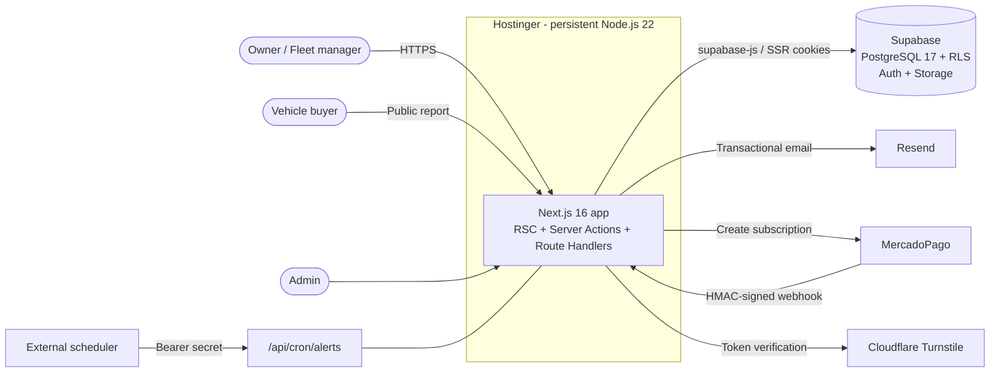
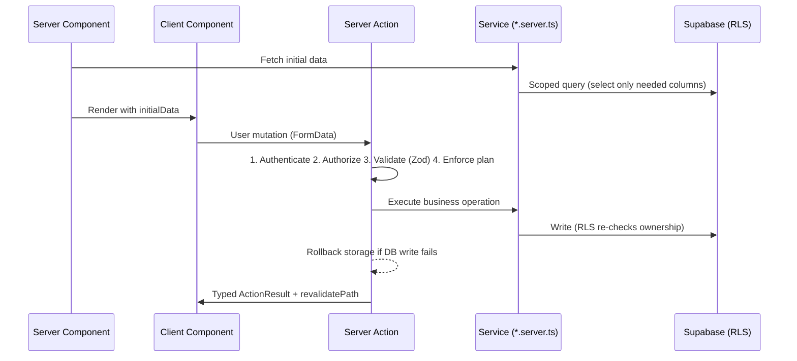
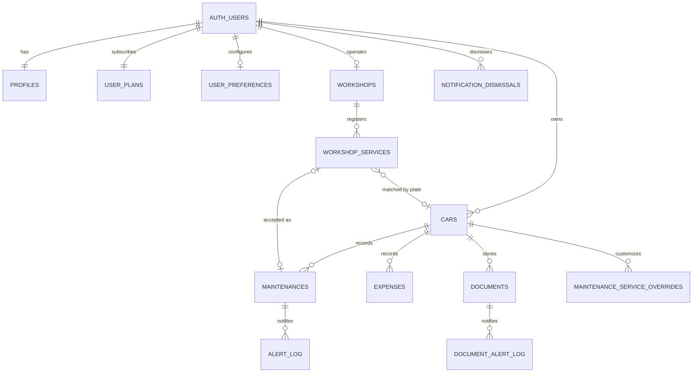
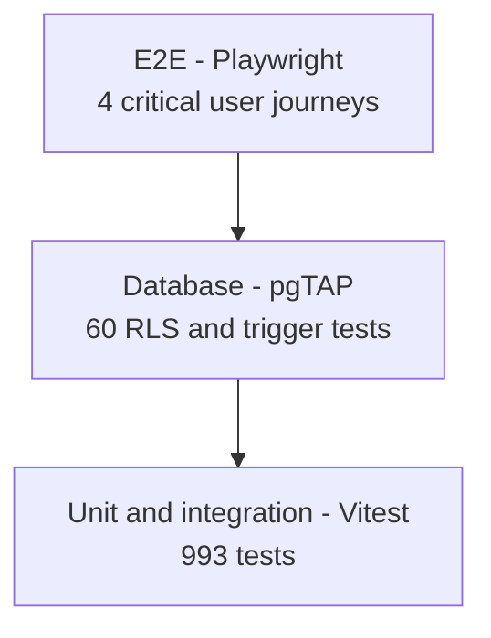
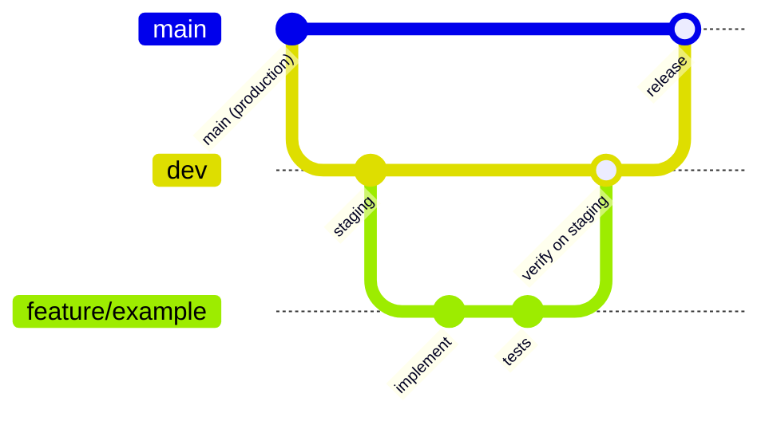

<div align="center">

# DocuAuto

**Vehicle maintenance, expenses and documentation management platform for individuals, families and fleets.**

**English** · [Español](README.es.md)

[](https://docuauto.com)


</div>

> DocuAuto is a production SaaS used in Argentina to keep a vehicle's full history in one place: maintenance, expenses, legal documents (VTV, insurance, GNC certification) and expiration alerts. Owners can share a **verified public report** of their vehicle when selling it.
>
> The source code is private. This document describes the product, architecture, engineering decisions and quality practices behind it.

<div align="center">
  
  <p><em>Fleet dashboard. All screenshots use demo data.</em></p>
</div>

---

## Table of Contents

- [Product Overview](#product-overview)
- [Key Features](#key-features)
- [Product Tour](#product-tour)
- [Tech Stack](#tech-stack)
- [Architecture](#architecture)
- [Data Model](#data-model)
- [Security](#security)
- [Domain Highlights](#domain-highlights)
- [Testing and Quality](#testing-and-quality)
- [Performance and Operations](#performance-and-operations)
- [Delivery Workflow](#delivery-workflow)
- [Getting Started](#getting-started)
- [Scripts](#scripts)
- [Engineering Conventions](#engineering-conventions)
- [Roadmap](#roadmap)
- [Author](#author)
- [License](#license)

---

## Product Overview

### The problem

In Argentina, keeping a vehicle compliant and well maintained means tracking many unrelated deadlines: periodic technical inspection (VTV/ITV), insurance renewal, GNC (compressed natural gas) certification and pressure tests, plus mileage-based services such as oil changes and timing belts. This information usually lives in paper folders, receipts and memory, and it is lost when the vehicle is sold.

### The solution

DocuAuto centralizes the complete lifecycle of each vehicle and turns it into actionable information:

- **Owners** see what is due next, by date or by kilometers, and get notified before it expires.
- **Families and small fleets** manage several vehicles from one dashboard with cost reports.
- **Buyers** can check a verified public maintenance report before purchasing a used car.
- **Workshops** (in development) will register services directly into their customers' vehicle history.

### Plans

| Plan | Vehicles | Highlights |
|---|---|---|
| Free | 1 | Maintenance log, expenses, documents, public vehicle report |
| Familiar | 3 | + Email expiration alerts, PDF/Excel export |
| Empresas | 15 | + Bulk CSV import |
| Pro | Unlimited | + Priority support |

Subscriptions are recurring payments processed through **MercadoPago**.

---

## Key Features

**Vehicle management**
- Vehicle profiles (powertrain: gasoline, GNC, diesel, hybrid, electric; heavy-duty; taxi/high-use) that adapt maintenance rules automatically
- Lifecycle states (`active`, `sold`, `retired`, `archived`); only active vehicles count toward plan limits
- Odometer protected against rollback at the database level, with immutable initial mileage
- Bulk import from CSV and export to PDF, Excel and CSV

**Maintenance intelligence**
- Rules engine with per-service intervals by kilometers, by time, or both (whichever comes first)
- Per-vehicle interval overrides
- Projections of the next service based only on real history (no invented data)
- Agenda view with upcoming and overdue items across all vehicles

**Documents and alerts**
- Secure document vault per vehicle (PDF/JPG/PNG) with expiration dates
- Daily cron job that emails consolidated alerts at 30 days, 15 days and on the due date, with deduplication logs
- In-app notification center with dismissible alerts

**Reports**
- KPIs, spend over time, cost per kilometer, category breakdown and vehicles requiring attention
- Configurable periods (30/90 days, 6/12 months, all time) with comparison against the previous period
- Verified public report per vehicle, shareable by link

**Platform**
- Authentication with email/password and Google OAuth, email confirmation and password recovery
- Subscription billing with webhook-driven plan activation and cancellation
- Admin panel: platform metrics, database size, server health, blog and workshop verification
- Built-in blog engine (Markdown editor, scheduling, SEO fields, dynamic sitemap)
- Transactional emails built with React Email (11 templates)
- Dark mode and fully responsive UI

---

## Product Tour

Every screen below is the real application running on demo data.

### Maintenance center


Pending work across the whole fleet, ranked by urgency. Each card states why the item is due: days overdue for time-based rules, kilometers overdue for mileage-based ones.

### Service projections


The maintenance engine computes both constraints of every rule (kilometers and time) from the latest real record and reports whichever comes first. Nothing is shown for a service with no history behind it.

### Agenda


Documents and maintenance merged into a single ordered list of deadlines, filterable by vehicle and by type.

### Vehicle detail


Per-vehicle summary, PDF export and the toggle that publishes the shareable maintenance report.

### Reports


Spend over time split by maintenance and operating costs, category breakdown, cost per kilometer and the vehicles concentrating the fleet's spend, all over a configurable period.

### Public vehicle report


The report an owner shares with a buyer: service timeline and mileage, served from a public route with no access to the rest of the account.

<details>
<summary><strong>More screens</strong></summary>

#### Adding a service


#### Service history


#### Document vault


#### Expenses


#### Report KPIs


#### Top vehicles by maintenance spend


#### Cost per kilometer


#### Account settings


#### Marketing site


#### Blog


</details>

---

## Tech Stack

| Layer | Technologies |
|---|---|
| **Frontend** | Next.js 16 (App Router, Server Components, Server Actions), React 19, React Compiler, TypeScript (strict) |
| **UI** | Tailwind CSS v4, shadcn/ui, Radix UI, Framer Motion, Recharts, Sonner, Lucide / Phosphor icons, next-themes |
| **Forms and state** | React Hook Form, Zod 4 (shared schemas client/server), nuqs (URL state for tables, filters, pagination) |
| **Backend** | Next.js Server Actions and Route Handlers on a persistent Node.js 22 process |
| **Database** | Supabase: PostgreSQL 17, Row Level Security, database triggers and functions, Storage, Auth |
| **Payments** | MercadoPago subscriptions (preapproval) behind a payment gateway abstraction, with a mock gateway |
| **Email** | Resend + React Email |
| **Security** | Cloudflare Turnstile, RLS, HMAC-verified webhooks, rate limiting, PII-masking logger |
| **Documents** | jsPDF + AutoTable, SheetJS (xlsx), PapaParse, react-markdown |
| **Testing** | Vitest 4 + V8 coverage, pgTAP (database/RLS), Playwright (E2E), k6 (load) |
| **Tooling** | ESLint 9, Supabase CLI, Docker, Git-based deployments |
| **Hosting** | Hostinger (Node.js), Supabase Cloud |

---

## Architecture

### System context



### Request lifecycle

Every feature follows the same flow, which keeps data fetching on the server and business rules out of the UI:



### Layering and dependency rules

```
lib/  →  services/  →  actions/  →  features/  →  app/
(low)                                              (high)
```

| Layer | Responsibility | Rule |
|---|---|---|
| `lib/domain/` | Pure domain rules (maintenance engine, vehicle status) | No I/O, no framework code |
| `lib/` | Shared utilities: plan checks, gating, dates, logger, schemas | Never imports from `features/` or `app/` |
| `services/*.server.ts` | Data access against Supabase | No orchestration |
| `actions/` | Server Actions: orchestration only | auth → authz → validation → plan → service → revalidate |
| `features/<name>/` | Feature-scoped components, hooks, schemas, services | Features do not import from each other |
| `app/` | Routes (App Router) | Thin: fetch through a feature service, pass props |

Three Supabase clients enforce the trust boundary: a **server** client bound to the user's session, a **browser** client, and a **service-role** client restricted to public operations that must bypass RLS (never used on behalf of an authenticated user).

### Repository structure

```
docuauto/
├── apps/web/                     # Next.js application
│   ├── src/
│   │   ├── app/                  # Routes: marketing, dashboard, billing, admin, taller, api
│   │   ├── actions/              # Server Actions
│   │   ├── services/             # Data access and integrations (billing, email, PDF)
│   │   ├── features/             # admin, agenda, blog, contact, dashboard, documents,
│   │   │                         # expenses, maintenance, reports, settings, vehicles, workshop
│   │   ├── lib/                  # Domain rules, plan enforcement, dates, logger, schemas
│   │   ├── components/           # shadcn/ui primitives, shared components, email templates
│   │   ├── types/                # Generated database types + domain types
│   │   └── proxy.ts              # Session refresh and route protection
│   ├── e2e/                      # Playwright end-to-end tests
│   └── scripts/verify.sh         # Local quality gate
├── supabase/
│   ├── migrations/               # Baseline schema + incremental migrations
│   └── tests/database/           # pgTAP security tests
└── performance/k6/               # Load tests
```

---

## Data Model

14 tables, all protected by Row Level Security (28 table policies), plus 13 storage policies across 6 buckets.



Business invariants are enforced **in the database**, not only in application code:

| Function / trigger | Guarantees |
|---|---|
| `check_vehicle_plan_limit` | A user can never exceed the vehicle limit of their plan, even through concurrent requests or bulk imports |
| `fn_ratchet_current_km` / `fn_cars_validate_current_km` | Odometer only moves forward |
| `normalize_plate` | License plates are stored in a canonical format |
| `has_write_access` / `is_subscription_active` | Read-only mode for lapsed subscriptions |
| `handle_new_user_plan` / `sync_profile_from_auth_user` | Every new account gets a plan and profile atomically |
| `prevent_workshop_verified_self_update` | Workshops cannot self-verify |

---

## Security

Security is layered so that a failure in one layer is caught by the next.

| Layer | Controls |
|---|---|
| **Edge / proxy** | Session refresh on every request, protected routes redirect to login with open-redirect-safe return URLs, admin routes gated at the proxy |
| **Forms** | Cloudflare Turnstile on login, signup and contact; per-IP rate limiting on authentication; account lockout flow after 3 failed logins |
| **Server Actions** | Authentication, ownership checks, Zod validation and plan enforcement on every write, regardless of UI state |
| **Database** | Row Level Security on all tables, ownership verified on parent rows for every child write, per-user storage folders, private buckets for documents |
| **Integrations** | HMAC signature verification on payment webhooks, shared secret on database webhooks, bearer secret on cron endpoints |
| **Data handling** | Storage/DB atomicity with rollback of orphaned files, generic error responses that do not leak resource existence, logger that masks emails, license plates and numeric IDs |
| **Content** | Markdown rendered without raw HTML (XSS-safe by design) |
| **HTTP** | HSTS (preload), `X-Frame-Options: DENY`, `X-Content-Type-Options`, strict Referrer-Policy and Permissions-Policy |

---

## Domain Highlights

A few engineering problems that shaped the codebase:

**Plan enforcement in three layers.** Limits are reflected in the UI (disabled actions with the reason), validated in every Server Action, and guaranteed by a PostgreSQL trigger. The UI is a convenience; the database is the source of truth.

**Maintenance engine with dual constraints.** Each service rule can define a kilometer interval, a time interval, or both. The engine computes both constraints from the latest real record, normalizes them to a common scale (average km/day) and reports whichever comes first. Rules adapt to the vehicle profile: an electric car has no oil changes, a GNC vehicle adds certification deadlines, a taxi gets shorter intervals.

**Timezone-safe dates.** PostgreSQL `date` values travel as `YYYY-MM-DD` strings and are never parsed as UTC. Month arithmetic clamps to the end of the month (Jan 31 + 1 month = Feb 28). The server process is pinned to `America/Argentina/Buenos_Aires`, so "today" is the same for cron jobs, reports and the UI regardless of the host timezone. This is guarded by a dedicated test.

**Payment gateway abstraction.** Billing depends on a `PaymentGateway` interface with a MercadoPago implementation and a mock one. Plan activation only happens through verified webhooks, never from the client redirect, so a user cannot activate a plan by visiting the success URL.

**Idempotent alerting.** The daily alert job groups expiring items per user into a single email and writes delivery logs, so retries or overlapping runs never send duplicates.

---

## Testing and Quality

### Test portfolio

| Level | Tool | Scope | Size |
|---|---|---|---|
| **Unit and integration** | Vitest 4 | Domain rules, Server Actions, services, API routes, webhooks, proxy, billing | 993 tests / 58 files |
| **Database security** | pgTAP on local Supabase | Real RLS: cross-user read/write/delete, anonymous access, storage buckets, plan-limit trigger | 60 tests / 5 suites |
| **End-to-end** | Playwright (Chromium) | Signup and login, protected routes, vehicle + document upload, plan limit, checkout | 4 critical flows |
| **Load** | k6 | Public pages and public vehicle report under concurrent users | p95 < 500 ms thresholds |



### Coverage

Measured with V8 on the Vitest suite. Thresholds are enforced per layer and only ratchet upward.

| Layer | Line coverage | Enforced floor |
|---|---|---|
| `src/lib` (domain rules, plans, dates) | **87%** | 85% |
| `src/actions` (Server Actions) | **79%** | 77% |
| `src/app/api` (webhooks, cron) | **78%** | 75% |
| `src/proxy.ts` (route protection) | **≥ 94%** | 94% |
| `src/services` (data access) | 41% | 39% |
| Whole codebase (includes UI components) | 37% | n/a |

Coverage targets business-critical code rather than a global number: data access paths are additionally validated against a real database by pgTAP and end to end by Playwright.

### Quality gate

Every push is preceded by a single command that must pass:

```bash
npm run verify   # ESLint → TypeScript (tsc --noEmit) → Vitest with coverage thresholds → production build
```

### Test engineering practices

- Deterministic time with fake timers, and date tests verified under multiple host timezones
- Mutation checks on critical assertions (for example, raising the plan limit must make the E2E limit test fail)
- E2E runs only against a local Supabase stack and refuses to start if pointed to a non-local URL; all third-party secrets are overridden
- Test data isolated by a dedicated email domain and cleaned before each run

---

## Performance and Operations

- **Rendering:** Server Components for data-heavy pages, static generation for marketing pages, ISR for the blog and sitemap
- **Queries:** column-scoped selects, pagination, parallel independent queries, batched fetches, aggregate queries for metrics
- **Runtime:** a single persistent Node.js process, which allows in-memory rate limiting and short-lived caches without external stores
- **Observability:** `/api/health` endpoint with database latency, admin server-health panel, structured logging with PII masking
- **Load testing:** k6 scripts with p95 latency thresholds for public traffic

---

## Delivery Workflow



| Branch | Purpose | Deployment |
|---|---|---|
| `feature/*`, `fix/*` | All implementation work, branched from `dev` | None |
| `dev` | Integration and QA | Auto-deploys to staging |
| `main` | Production | Auto-deploys to docuauto.com |

Database changes are versioned SQL migrations over a production baseline, with generated TypeScript types for end-to-end type safety.

---

## Getting Started

> Access to the repository is restricted. These steps are for authorized contributors.

### Prerequisites

- Node.js 22
- Docker Desktop (local Supabase stack)
- Supabase CLI

### Setup

```bash
git clone <repository-url>
cd docuauto/apps/web
npm install
cp .env.example .env.local        # fill in the values described in .env.example
```

For local development set `PAYMENT_GATEWAY=mock` so no real payments are created.

### Run

```bash
npx supabase --workdir ../.. start   # local PostgreSQL, Auth and Storage (requires Docker)
npm run dev                          # http://localhost:3000
```

---

## Scripts

All commands run from `apps/web/`.

| Command | Description |
|---|---|
| `npm run dev` | Development server |
| `npm run build` / `npm run start` | Production build and server |
| `npm run lint` | ESLint |
| `npm run test` | Vitest suite |
| `npm run test:coverage` | Vitest with coverage thresholds |
| `npm run test:db` | pgTAP database security tests (requires local Supabase) |
| `npm run test:e2e` | Playwright end-to-end tests (requires local Supabase) |
| `npm run verify` | Full quality gate: lint, types, tests with coverage, build |
| `npm run update-types` | Regenerate database types from the Supabase schema |

---

## Engineering Conventions

- **Strict typing:** `any` is prohibited; database types are derived from the generated schema or query inference, never asserted
- **Server-first data fetching:** no client-side fetch waterfalls; table state lives in the URL
- **Server-only boundary:** files that touch secrets or the database use the `*.server.ts` suffix
- **Explicit locale:** every date and number formatting call passes `es-AR` to keep server and client output identical
- **No opportunistic refactors:** changes stay scoped to the task; improvements are documented and planned separately
- **Documentation:** one-line doc comment on every exported function; conventional commit messages

---

## Roadmap

- **Workshop portal:** workshops register services by license plate and owners approve them into their vehicle history (foundations shipped behind a feature flag)
- Workshop subscription tier and customer statistics
- Broader component-level test coverage for the UI

---

## Author

**Nicolás Boscasso** · Full-stack developer

[](https://www.linkedin.com/in/nicolas-boscasso/)
[](https://github.com/nicob201)

Designed, built and operated end to end: product, architecture, database, security, testing and deployment.

---

## License

Proprietary software. All rights reserved. The source code is not publicly available.
